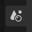
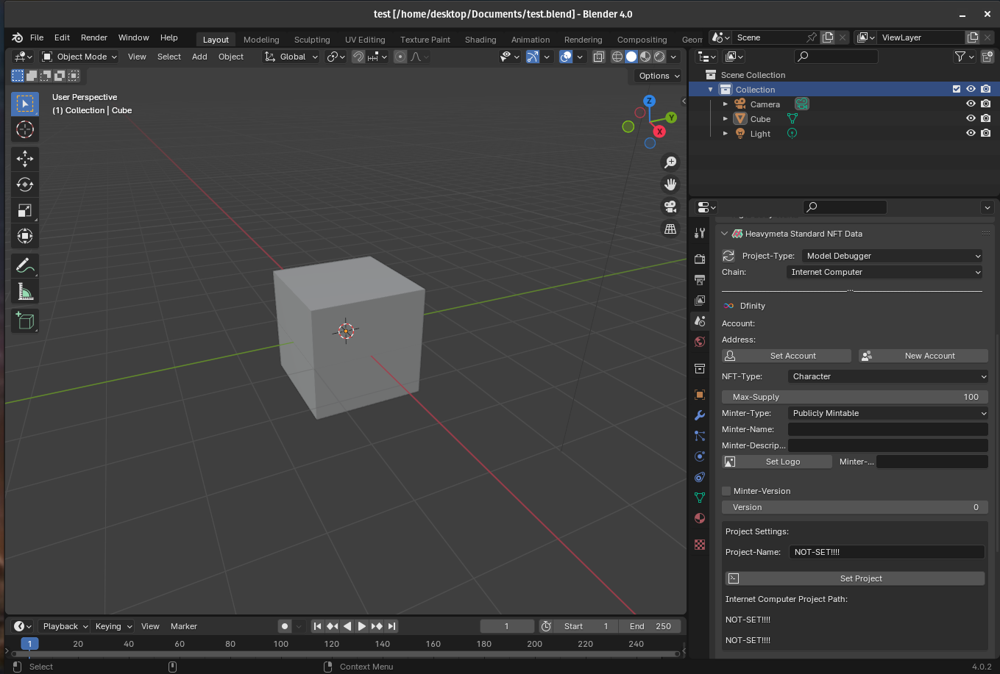
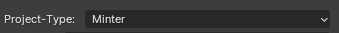
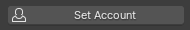
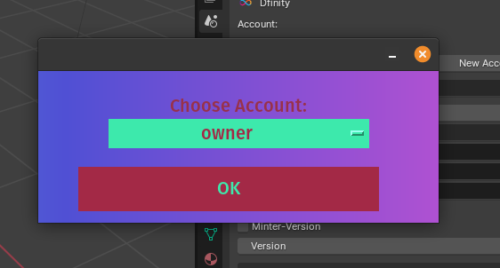
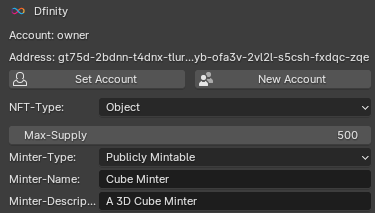
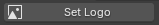
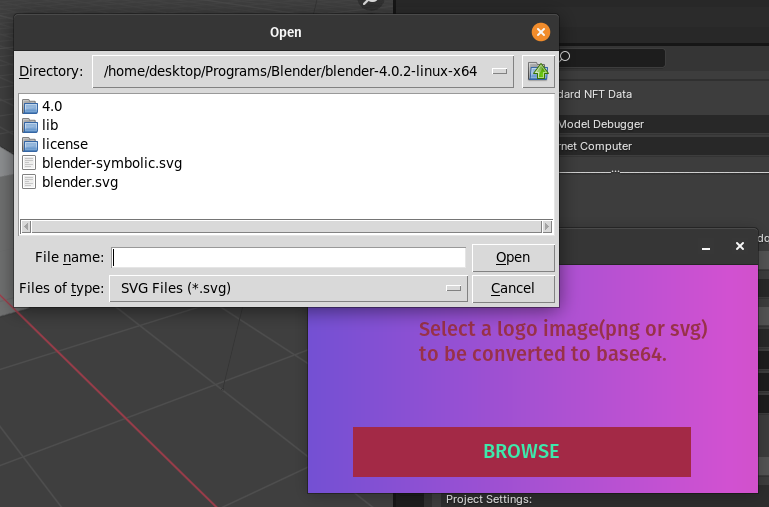
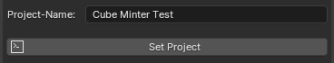
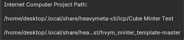

## Minter Setup Example

We open a new Blender Scene, and just use the default cube for our example.

Make sure the 'Scene Tab' is selected in Blender.

Save the file as "test", or whatever name you choose.  The exported gltf name will be the same as the blender file name, so saving the file is required.
* * *

Set the 'Project-Type' to 'Minter'.
* * *

Next, we'll set the Account for this file, by pressing the 'Set Account' Button.

Choose an account from the drop down list.
* * *

Then we fill in the required minter fields. Choosing a 'NFT-Type' of 'Object', the 'Max-Supply' to 500, the 'Minter-Name' to 'Cube Minter', the 'Minter-Description' to 'A 3D Cube Minter'.
* * *

Next, we can add an image for our minter by pressing the 'Set Logo' button.

We can choose an svg or a png file which be serialized into base64 to be used in the smart contract.
* * *

Now we set the 'Project-Name' to 'Cube Minter Test', and press the 'Set Project' button.

It will take some time to setup the project, when complete projects will be visible in 'Project-Settings'.
* * *