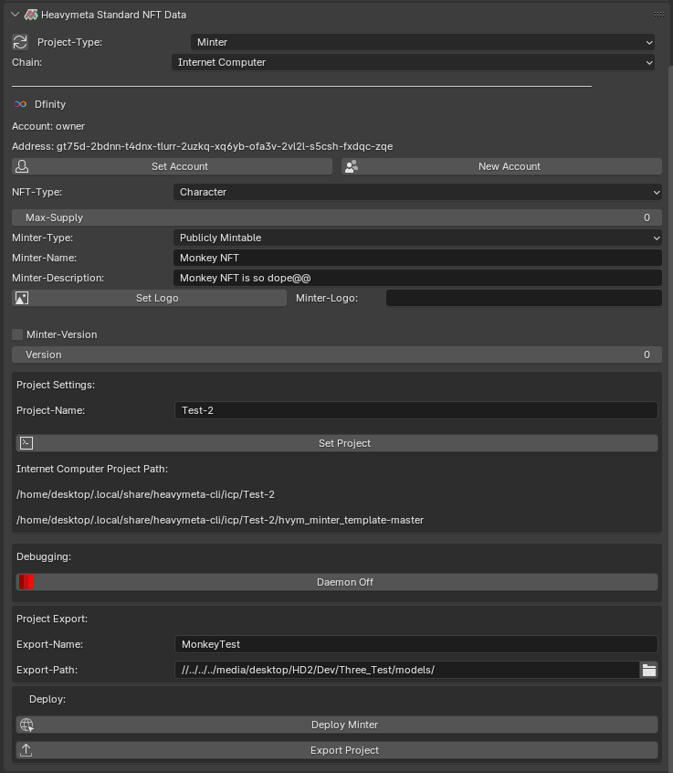

## NFT Minter Settings

**Blender Scene Tab:**

* * *

**Model Debugger**
Used to debug, or display assigned Proprium in Browser.

**Attributes:**

Project-Type

This sets the template used for your project.

Chain

This is the chain used to deploy your project.  Currently Heavymeta only supports Dfinity Internet Computer Protocol.

Set Account

This the account that will be used to deploy your project.

New Account

Create a new account that will be used to deploy your project.

NFT-Type

These are Heavymeta Standard NFT types: Character, Animal, Immortal, Weapon, Object, Generic, Auricle.

More detail about these conventions is in the Standards section.

Minter-Type

Privately Mintable: (Can be minted only by creator)

Publicly Mintable: (Can be minted by any account)

Minter-Name

The name of this minter.

Minter-Description

The description of this minter.

Set Logo

If pushed, will launch a popup to select an image file that will be serialized and set in the 'Minter-Logo' field.

Minter-Version

If Checked 'Version' is used.

Version

The version used for this minter.

* * *
**Project Settings:**

Project Name

The name used for your project. 

Set Project

Pushing this button will give you a popup, and create a new project template for use by the cli. 

* * *
**Debugging:**

Daemon(Off/On)

Pushingwill toggle the dfx daemon on or off, it must be on to test and deploy your project locally.

* * *
**Project Export:**

Export-Name

This defines the name if you want to export your project to a new location

Export-Path

The oath that your project will be exported to.

Export-Project

Pushing this button will export the project folder to the 'Export-Path'

* * *

* * *
**Deploy:**

Deploy

Pushing this button will show a dialog to deploy your project to the main net.

Export-Project

Pushing this button will export the project folder to the 'Export-Path'

* * *

