## NFT Data - Action

**Blender Nonlinear Animation Editor:**  
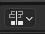
***
***Overview***
Heavymeta Actions are preset interactions that can be assigned to play a particular animation, or set of animations in order, when either interacting with an assigned mesh, or performing an assigned interaction type.
***
***NLA Tracks in Blender***
Working with NLA(Non Linear Animation) Tracks in Blender can be a bit non-intuitive. Heavymeta Action Data is assigned per NLA Track.  When working with object animation in the NLA editor, animation keys are shown in an 'Action' Track:
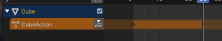
The animation in this 'Action' track must be pushed down into an NLA track by pushing the 'Push Down Action' Button:
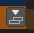
Once pushed down into an NLA track it will look like this:
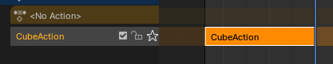
The Heavymeta Action Editor will be available in a tab to the right of the Blender Action Editor:
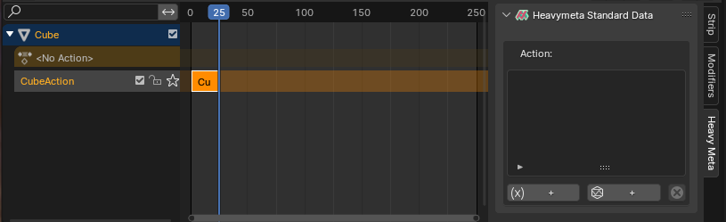
***
***Using the Heavymeta Action Editor***
The Action editor has two options for action creation:
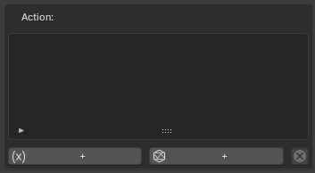
***
***Basic Action Button:***
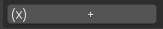

Details
 

Pressing this button will create an 'Action Property', in the editor which should be assigned a unique name:
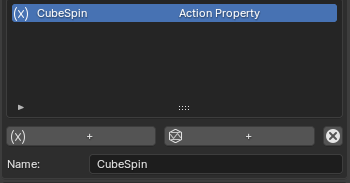
Upon creation a track editor for assigning animation tracks appear below:
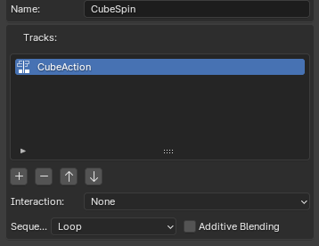
Our original Blender NLA Track is already present here.  We can then create additional NLA Tracks and order them how we'd like them to play:
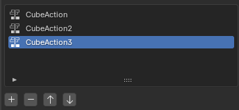
Then we choose an interaction type:
-***Click:***  Anytime the user clicks, the animation will be played.
-***Double Click:***  Anytime the user double clicks, the animation will be played.
-***Mouse Wheel:***  Anytime the user moves the mouse wheel, the animation will be played.
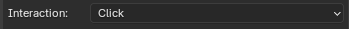
Lastly, we define how the animation set should play, and whether or not additive blending should be applied:
-***Loop:***  Animations are played in order, starting from the beggining when the last track is played.
-***One Shot:***  Animations are played in order one time only.
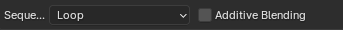
***

***Mesh Action Button:***
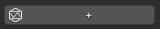

Details
 

Largely the same as the Basic Action, the difference being that the assigned interaction applies to the assigned mesh reference.
Pressing this button will create an 'Action Property', in the editor which should be assigned a unique name:
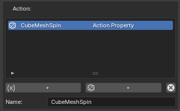
Upon creation a track editor for assigning animation tracks appear below:
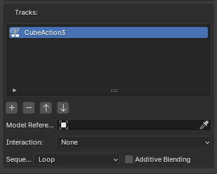
Our original Blender NLA Track is already present here.  We can then create additional NLA Tracks and order them how we'd like them to play:

The Mesh Action requires a mesh reference to be assigned:
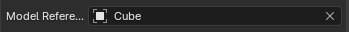
Then we choose an interaction type:
-***Click:***  Anytime the user clicks, the animation will be played.
-***Double Click:***  Anytime the user double clicks, the animation will be played.
-***Mouse Wheel:***  Anytime the user moves the mouse wheel, the animation will be played.

Lastly, we define how the animation set should play, and whether or not additive blending should be applied:
-***Loop:***  Animations are played in order, starting from the beggining when the last track is played.
-***One Shot:***  Animations are played in order one time only.

***

