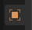
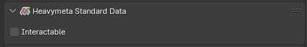
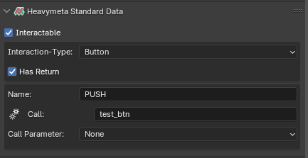
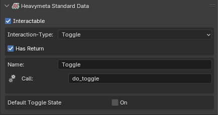
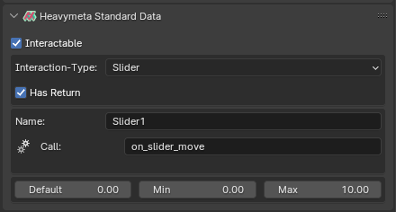
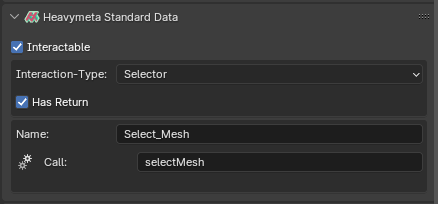

## NFT Data - Interactables

**Blender Object Tab:**  

***

It might be the case that instead of relying on the menus generated by Proprium-Js, you want to assign interactivity to elements in a 3D model.  In Heavymeta these are called Interactables.  Four widget types are currently supported.

Every object has an 'Interactable' checkbox, if enabled, and a widget type is chosen, the object will have interactable in the browser.

***
**Interactable Button**

-**Name:** Must be unique, used as an identifier by Propium-Js.
-**Call:** This is string that maps to a Motoko method defined in a Smart Contract.
-**Has Return:** If checked, the corresponding Motoko method should have a return value.
-**Call Parameter:** Can be None, Int, or Float, in which case the defined parameter is passed to the method.
***
**Interactable Toggle**

*The Motoko method for this Interactable should always accept a bool parameter, as the toggle state will be passed to the defined method.

-**Name:** Must be unique, used as an identifier by Propium-Js.
-**Call:** This is string that maps to a Motoko method defined in a Smart Contract.
-**Has Return:** If checked, the corresponding Motoko method should have a return value.
-**Default Toggle State:** If checked, the toggle will be On(true), else Off(false).
***
**Interactable Slider**

*The Motoko method for this Interactable should always accept an int or float parameter, as the selected slider value will be passed to the defined method.

-**Name:** Must be unique, used as an identifier by Propium-Js.
-**Call:** This is string that maps to a Motoko method defined in a Smart Contract.
-**Has Return:** If checked, the corresponding Motoko method should have a return value.
-**Default:** Default value of the slider in browser.
-**Min:** Minimum value of the slider in browser.
-**Max:** Maximum value of the slider in browser.
***
**Interactable Selector**

*The Motoko method for this Interactable should always accept a string paramet, as the selected mesh name will be passed to the defined method.

-**Name:** Must be unique, used as an identifier by Propium-Js.
-**Call:** This is string that maps to a Motoko method defined in a Smart Contract.
-**Has Return:** If checked, the corresponding Motoko method should have a return value.

