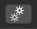

## NFT Data - Proprium

**Blender Collections Tab:**  

* * *
## Data Types and Assignment
Assignment of Proprium data is  done at the collection level in Blender.  This means, objects in a given collection share the Proprium that is assigned to them.  Any references to object in the data itself, should also be part of the collection,

| |Value Properties|
|------------------------------------------------------------|-----------------------------------------------|

Numeric values represented by meters or sliders
 

* * *

A unique name should be assigned to the property.

* * *
Value Properties should be used for values of type 'Int' or 'Float'. 

* * *
If 'Show Widget' is true, a widget will be created for the data when viewed in the Browser.

* * *
The action types are predefined behaviors for the the way the data value may be updated.

Action Types:
-Incremental (Value can Only be incremented, by Amount)
-Decremental (Value can Only be decremented, by Amount)
-Bicremental (Value can be incremented or decremented, by Amount)
-Setter (Value can be incremented or decremented Arbitrarily)
-Static (Value cannot be changed)
***

-Default: The default value for this property.
-Min: The minimum value for this property.
-Max: The maximum value for this property.
-Amount: The amount the property will increment or decrement.
***

| |Method Call|
|------------------------------------------------------------|-----------------------------------------------|

A string that maps to a method name in  a Motoko contract.

A unique name should be assigned to the property.

***
Method accepts an optional single parameter of type Int or String.

***

| |Mesh Property|
|------------------------------------------------------------|-----------------------------------------------|

Toggle visibility of a mesh reference.

 

A unique name should be assigned to the property.

***
Reference to mesh in scene must be assigned

***

To update the mesh visibility state, widget must be set to 'Toggle'
***

Assign the initial state of the mesh with the 'Visible' check-box.
***

| |Mesh Set|
|------------------------------------------------------------|-----------------------------------------------|

A set of mesh references, of which one is selected and visible.

 

A unique name should be assigned to the property.

***

To update the mesh visibility state, widget must be set to 'Selector'
***

Any number of mesh references may be assigned.
***

||Morph Set|
|------------------------------------------------------------|-----------------------------------------------|

For each morph in the set, a slider is created to control it.

 

A unique name should be assigned to the property.

***

Multi-widget type means, multiple widgets are created, one for each in the set.
***
Any number of morph references can be assigned to the set.

***

| |Animation Property|
|------------------------------------------------------------|-----------------------------------------------|

Toggle an animation for a mesh.

A unique name should be assigned to the property.

***
To play or stop the animation, widget must be set to 'Toggle'

***
The 'Loop' attribute determines how the animation plays

-Loop Forever (Animation continues to play indefinitely)
-Loop Once (Animation plays once and then stops)
-Clamp Toggle (On state, is animation holding it's last frame, Off ifs frame 0)
-Clamp (Plays once and hold it's last frame)
-Ping Pong (Plays to the end, then reverses and plays to the beginning, indefinitely)
***
The 'Weight' attribute controls how much the model is affected by the animation.  

***
The 'Play' checkmark, is the default state for the animation. If checked, it plays on start.

***

| |Material Property|
|------------------------------------------------------------|-----------------------------------------------|

Generates multiple widgets in for the material in the browser, so attributes can be updated and saved.

 

A unique name should be assigned to the property.

***

Multi-widget type means, multiple widgets are created for each attribute in the material.
***
The material reference must be assigned for data item to work.

***
If the material is meant to have reflective or iridescent properties, the corresponding checkboxes must be checked.

***

| |Material Set|
|------------------------------------------------------------|-----------------------------------------------|

Used to create a set of materials that can be applied to a model, or models.

A unique name should be assigned to the property.

***

To update the material on the model(s), widget must be set to 'Selector'
***
The 'ID' attribute pertains to the material id, assigned to the mesh.(The set of faces, the material is applied to)

***
The editor section allows you to add and remove materials to the set.

***

***
## Menu Placement
The Proprium menus that are generated in the browser are created at a preset location in relation to the size of the collection.  If you want to have them generated at a custom position, use the 'Add Menu Transform' button, to spawn a dummy object which can be moved around, and will be used assign a custom position to the menu in the browser.

***
## Data Types Organization and Name Re-Mapping
When the Proprium menus are generated in the browser, there is a section for each collection with data assigned.  The sections are grouped by data type, for example, if you create several 'Value Properties', within a collection, By default they are grouped into a section Labeled 'Value Properties'.

The default data type names can be renamed by re-mapping them in the 'Property Names:' Section.

***

