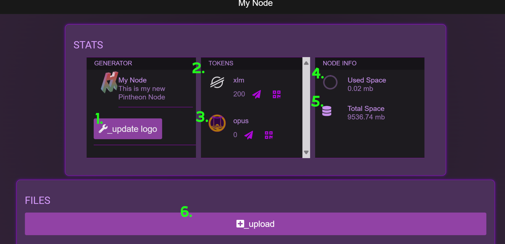
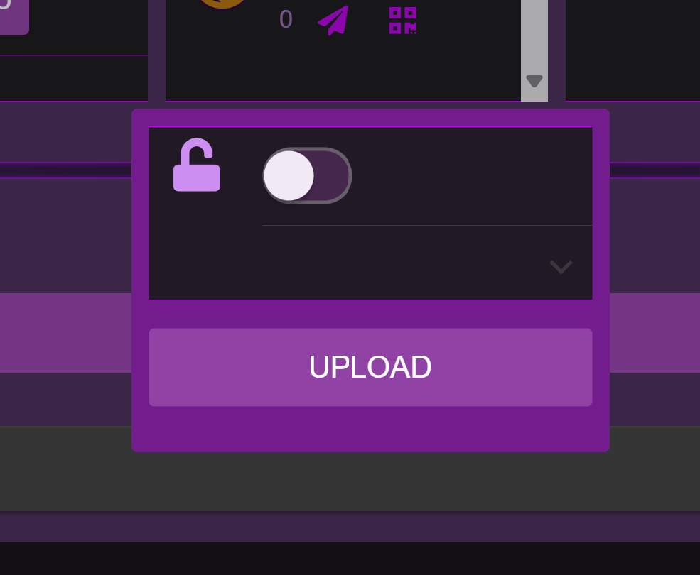
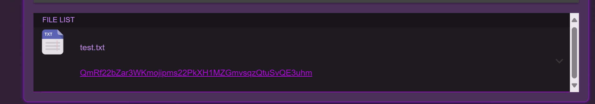
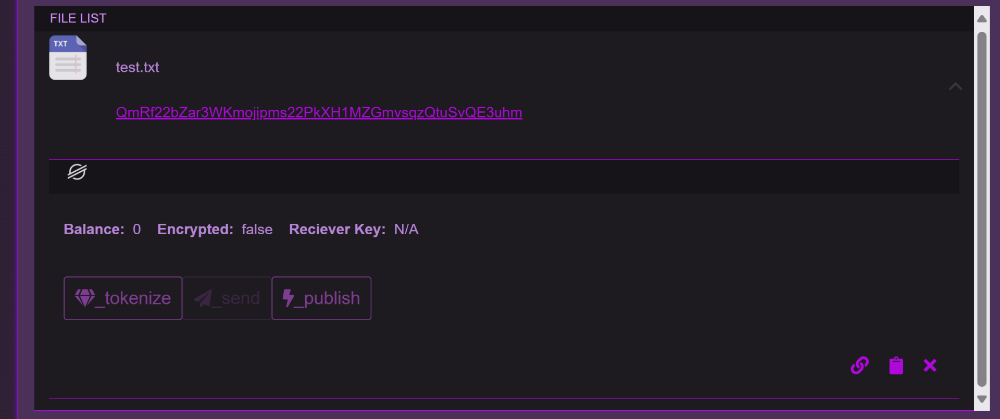
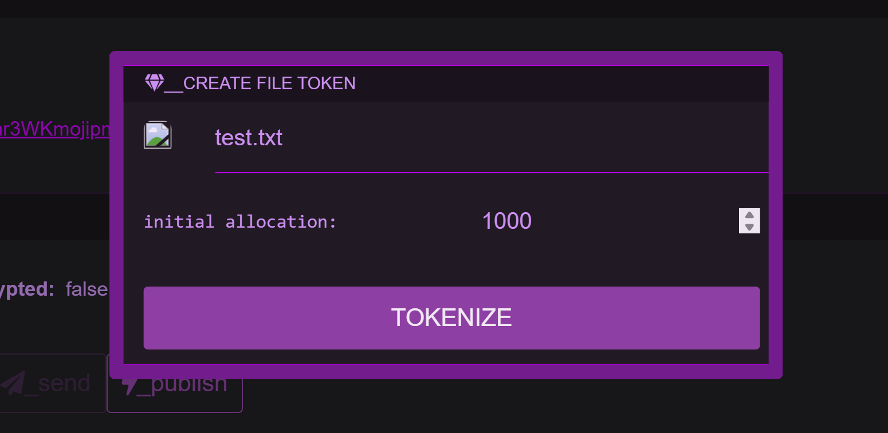

## Dashboard

* * *

1.  

Update Logo
 This button allows you to set a custom logo image for the node.

2.  

XLM Wallet
 This allows you to see the XLM balance of the node, as well as send and receive XLM from the node wallet.

3.  

OPUS Wallet
 This allows you to see the OPUS balance of the node, as well as send and receive OPUS from the node wallet.

4.  

Used Space
 This is an indicator of the space used by the ipfs repo.

5.  

Total Space
 This is an indicator of the total space available in the ipfs repo.

6.  

Upload
 This button is used to upload files to the ipfs repo.

* * *

## Upload

After pressing the main dashboard 'upload' button a dialog will open.  Here you can choose whether or not you want to encrypt the file, then press the 'upload' dialog button, to select the file that will be uploaded.

* * *

## File List

Once upload is complete, the file icon and hash will appear in the list below the 'Upload' button.

* * *

## Tokenization

Each file list item can expanded to reveal the available Stellar Ledger functions associated with it. Clicking the 'Publish' button will create a Smart Contract event call, that will publish the file information to the Stellar Ledger.

Clicking the 'Tokenize' button allows you to create a token associated with the file.  An initial allocation can be set, which is the amount of this file token that will be minted to the node wallet.  This file token can be transferred to any Stellar compatible wallet, and the associated contract holds the metadata for the particular file.