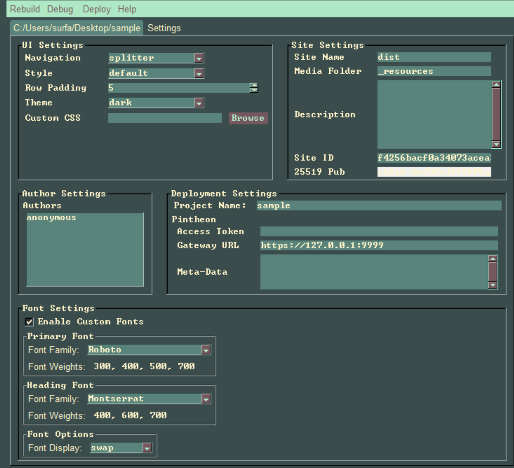
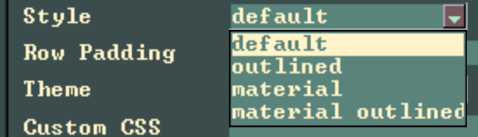
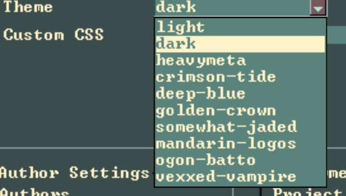

***

UI Settings

These settings deal with the look of the rendered site.

Navigation
 
This drop-down sets to navigation type for the rendered site.

Style

This is used to set the style types, subtle differences in styling of site elements.

Row Padding
 
This sets the spacing between Article columns.

Theme
 

Drop-down with custom color schemes

Custom Theme
 
A custom css theme can be generated at the [Onsen Theme Roller](https://onsen.io/theme-roller).

Once a new theme is created and downloaded, the downloaded theme contains multiple files. The file 'theme.css' is the file we want to select, to customize the site css.

***

Site Settings

Site Name
 
This sets the folder name that the rendered site is saved to.

Media Folder
 
This is the folder that is used for media files used in the markdown files.

Description
 
This sets the site description, used in site meta-data.

Site ID
 
This sets the site ID used in site meta-data.

25519 Pub
 
This is the 25519 Stellar Public Key, used for pairing Press with your Pintheon node, for easy uploads.

***

Author Settings

Authors
 
Right clicking this field will popup ui, to add a new author to the project.

***

Deployment Settings

Project Name
 
Name of the project, based on project base folder.

Access Token
 
After creating an access token for Press in your Pintheon node, paste it here.

Gateway URL
 
This is the url that the Pintheon node is running on.

Meta-Data
 
This sets any additional site meta-data.

***

Font Settings

Enable Custom Fonts
 
Enable custom fonts for the rendered site.

Primary Font
 
Set the primary font family.

Heading Font
 
Set the heading font family.

Font Options
 
This sets how the fonts are loaded.

